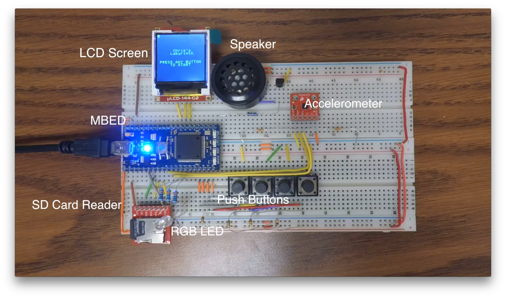

# Maze Runner
A Labyrinth Style game for LPC1768 Mbed microcontroller.

### Board and Perihperals

### Where to Start
Check out main.cpp first; all of the game logic is there.  The bulk of the rest of the project is in game.cpp.  Most of the other files are contain useful classes and libraries.

### Demo
Check out a live demo [here](https://www.youtube.com/watch?v=src6Vlo8ayc).
